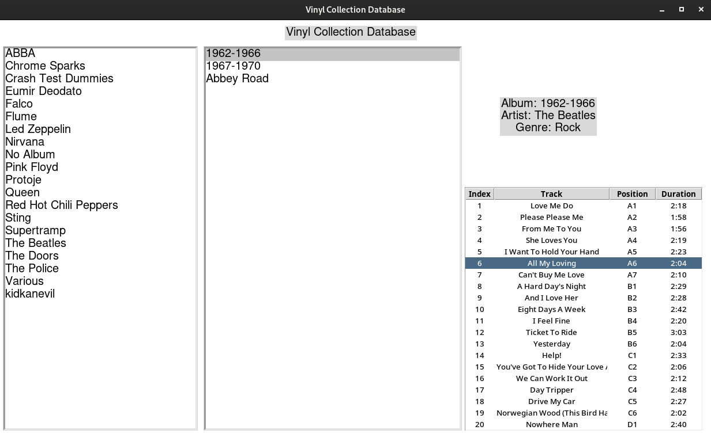

# Vinyl Database Manager
## 0.1.5

A simple GUI-Script that fetches tracks and other information of your .csv vinyl database.



You can read my blog about this project on my [website.](http://quasolaris.tech/posts/vinylCollectionPart1.html)

[Buy Me A Coffe!](https://www.buymeacoffee.com/quasolaris)

## Content Table
1. Set Up
2. Insert own database
3. Update Database

## 1. Set Up
To be able to run the GUI-Script a few steps need to be done in advance. The guide is for Linux but it should be more or less the same on Windows and OSX.

### Getting an Access-Token for the Discogs API
You will need an access code for the Discogs API, for that do the following when logged in at Discogs:

1. Click user avatar on top right of screen
2. Click Settings
3. Go to Developers
4. Click Generate new token

[Discogs Authentification Doc](https://python3-discogs-client.readthedocs.io/en/latest/authentication.html)

### Installing Dependencies
This is a Python script, therefore you will need the newest Python 3 version:
[How to install Python](https://www.python.org/downloads/)

Important for Windows users, check that the PATH variables are set correctly. If not it could lead to problems regarding pip and the GUI

### Python dependencies
The script needs three PIP packages to work, to install them copy and paste the following lines into your terminal:

The following is for Debian based Linux distributions, for Windows or Fedora the command could vary, a quick web search will help you.
```
pip3 install python3-discogs-client

pip install pandas

sudo apt install python3-tk
```

### Insert your authentication key
Open the file ```/src/updateDB.py``` with a text editor of your choice and replace "YOUR_ACCESS_TOKEN_HERE" with your token. It then should look something like this:
```
USER_TOKEN = "lknjdfg9876324bkjdfoiuh" # insert your token here
```
Your system should now be ready to run the script, to test it run the following command inside the src folder (at the moment the script does use relative paths, if run form an other directory it will not work):
```
python3 updateDB.py
```
If everything is OK then the script will fill the working database with test data, taken from the ```/database/template_file.csv``` file. The output should look like this:

```
YOUR@USER:VinylDatabaseManager/src$ python3 updateDB.py 
Found entries:  39
====== 5 Sec. Pause for API cooldown =====
0  fetching:  Synchronicity
1  fetching:  Regatta De Blanc
2  fetching:  The Doors
3  fetching:  L.A. Woman
4  fetching:  Ghost In The Machine
5  fetching:  Zenyatta Mondatta
8  fetching:  Led Zeppelin
9  fetching:  Led Zeppelin (Remastered)
10  fetching:  Atom Heart Mother
11  fetching:  The Division Bell
12  fetching:  The Dark Side Of The Moon
13  fetching:  Pompeii
14  fetching:  On A Plain
16  fetching:  Gold (Greatest Hits)
17  fetching:  Greatest Hits
18  fetching:  Solar Fire
19  fetching:  Falco60
20  fetching:  The Best Of 25 Years
21  fetching:  1962-1966
22  fetching:  1967-1970
23  fetching:  Abbey Road
24  fetching:  Star Edition
25  fetching:  AN 1 - Apocalypse Now
26  fetching:  God Shuffled His Feet
29  fetching:  Even In The Quietest Moments...
30  fetching:  Who Knows
32  fetching:  My Little Ghost
33  fetching:  Flume
35  fetching:  Skin
37  fetching:  Sparks EP
38  fetching:  Stadium Arcadium
Writing DB to file
                  title      artist genre                                          tracklist
0         Synchronicity  The Police  Rock  $index[1] Synchronicity I $side[A1] $dur[3:23]...
1      Regatta De Blanc  The Police  Rock  $index[1] Message In A Bottle $side[A1] $dur[4...
2             The Doors   The Doors  Rock  $index[1] Break On Through (To The Other Side)...
3            L.A. Woman   The Doors  Rock  $index[1] The Changeling $side[A1] $dur[4:20]\...
4  Ghost In The Machine  The Police  Rock  $index[1] Spirits In The Material World $side[...
```
When this script finished successfully, you can run the following command:
```
python3 vinyl_tool.py 
```
A window should now open where you can choose the artists on the left, their albums in the middle and get detailed information on the right.

## 2. Insert own Database
### Your database NEEDS two columns that have the artist and the album present
Look into the ```/database/template_file.csv``` file to see what information has to be present. There can be more columns with more information, the script ignores them but artist and album need to be present.

##### Make a backup of your database NOW, the script should not write into the original file but better save than sorry

To insert your own database you can do it in two ways:
### First way (easy)
Rename your database to ```template_file.csv``` and replace the file inside the ```database/``` folder. The run the update script to fill the GUI-database with your entries:

REMINDER: run this inside the src folder
```
python3 updateDB.py
```
Depending on your database, you can make yourself a coffee and wait, every few API calls the script will wait for 5 seconds to not get blocked by their DDoS protection. When the script is finished you can run the GUI-Script, again inside the src folder:
```
python3 vinyl_tool.py
```
You should now be able to browse your database with track information.

### Second way (Harder but better)
Open the ```/src/updateDB.py``` file and replace the template_file.csv path with the relative path to your database, it should look something like this:
```
USER_DATABASE = "../../someFolder/yourNowBackedUpDatabase.csv" # change path to your vinylDB file
```

REMINDER: run this inside the src folder
```
python3 updateDB.py
```
Depending on your database, you can make yourself a coffee and wait, every few API calls the script will wait for 5 seconds to not get blocked by their DDoS protection. When the script is finished you can run the GUI-Script, again inside the src folder:
```
python3 vinyl_tool.py
```
You should now be able to browse your database with track information.

## 3. Update Database
To update your database you can simply update your .csv and then rerun the following command:
```
python3 updateDB.py
```
At the moment the whole database gets downloaded again, in a further update will be an overhaul of the update process, to just download the albums that are already present.
